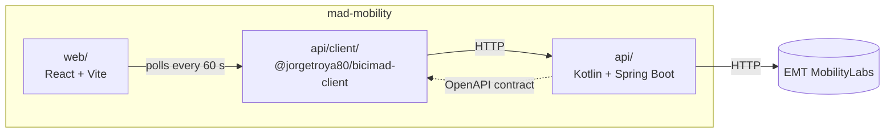

# Mad Mobility

Madrid mobility data, starting with BiciMAD, built on the EMT Madrid MobilityLabs API.

## Overview

What works today:

- **BiciMAD stations API**: list all stations and look one up by its number (`/v1/bicimad/stations`, `/v1/bicimad/stations/{number}`).
- **Typed client**: every API release publishes `@jorgetroya80/bicimad-client` to GitHub Packages, generated from the OpenAPI contract.

Coming next: a web map showing live station availability. Buses come later.

## Architecture

The repo is a monorepo with two apps. The API defines its OpenAPI contract in code (served at `/v3/api-docs` in local dev only); the web never hand-writes API types and talks to the API only through the client generated from that contract.

| Path                        | Contents                                                    |
| --------------------------- | ----------------------------------------------------------- |
| [`api/`](api/README.md)     | Spring Boot API that wraps MobilityLabs                     |
| [`api/client/`](api/client) | TypeScript client generated from the API's OpenAPI contract |
| [`web/`](web/README.md)     | React frontend                                              |
| [`docs/`](docs)             | Ideas, specs and plans                                      |

See each app's README for its internal architecture.

## License

Code released under the [MIT License](LICENSE).

Data powered by [EMT de Madrid](https://www.emtmadrid.es) through [MobilityLabs](https://mobilitylabs.emtmadrid.es/), under its [terms of use](https://mobilitylabs.emtmadrid.es/sip/terms-of-use).
