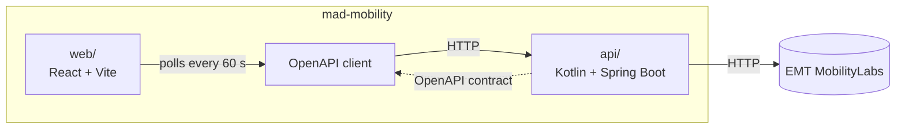

# Mad Mobility

[](https://github.com/jorgetroya80/mad-mobility/actions/workflows/ci.yml)
[](https://github.com/jorgetroya80/mad-mobility/releases)
[](https://github.com/jorgetroya80/mad-mobility/releases)
[](LICENSE)

Madrid mobility data, starting with BiciMAD, built on the EMT Madrid MobilityLabs API.

## Overview

What works today:

- **BiciMAD stations API**: list all stations and look one up by its number (`/v1/bicimad/stations`, `/v1/bicimad/stations/{number}`).
- **Typed client**: every API release publishes `@jorgetroya80/bicimad-client` to GitHub Packages, generated from the OpenAPI contract.

Coming next: a web map showing live station availability.

## Tech stack

**Backend** ([`api/`](api/README.md))

- Kotlin 2.3 on Java 25, Spring Boot 4.1 (Web MVC, virtual threads)
- Spring Modulith for module boundaries
- Caffeine cache and Resilience4j for calls to the EMT
- springdoc for the OpenAPI contract, Gradle 9 for the build
- JUnit, MockK, WireMock and Testcontainers for tests

**Frontend** ([`web/`](web/README.md))

- React, Vite and TypeScript on Node 24, with pnpm
- MapLibre for the map, Tailwind for styling
- TanStack Query for data fetching
- `@jorgetroya80/bicimad-client` (openapi-typescript + openapi-fetch) for typed API calls

## Architecture

The repo is a monorepo with two apps. The API defines its OpenAPI contract in code (served at `/v3/api-docs` in local dev only); the web never hand-writes API types and talks to the API only through the client generated from that contract.



| Path                        | Contents                                                    |
| --------------------------- | ----------------------------------------------------------- |
| [`api/`](api/README.md)     | Spring Boot API that wraps MobilityLabs                     |
| [`api/client/`](api/client) | TypeScript client generated from the API's OpenAPI contract |
| [`web/`](web/README.md)     | React frontend                                              |

See each app's README for its internal architecture.

## Running locally

You need JDK 25 and EMT MobilityLabs credentials ([sign up](https://mobilitylabs.emtmadrid.es/)). The web app is not built yet, so only the API runs for now.

1. Copy the env template and fill in your credentials (`EMT_EMAIL` and `EMT_PASSWORD`):

   ```bash
   cp api/.env.example api/.env.local
   ```

2. Start the API on `localhost:8080`:

   ```bash
   cd api && ./gradlew bootRun
   ```

3. Try it:

   ```bash
   curl 'localhost:8080/v1/bicimad/stations?near=40.4168,-3.7038&radius=500&need=docks'
   curl localhost:8080/v1/bicimad/stations/538
   ```

Swagger UI is at `localhost:8080/swagger-ui.html` while `bootRun` is running. Run the tests with `./gradlew test` (no credentials needed).

## License

Code released under the [MIT License](LICENSE).

Data powered by [EMT de Madrid](https://www.emtmadrid.es) through [MobilityLabs](https://mobilitylabs.emtmadrid.es/), under its [terms of use](https://mobilitylabs.emtmadrid.es/sip/terms-of-use).
